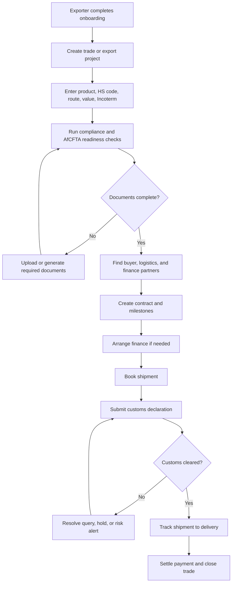
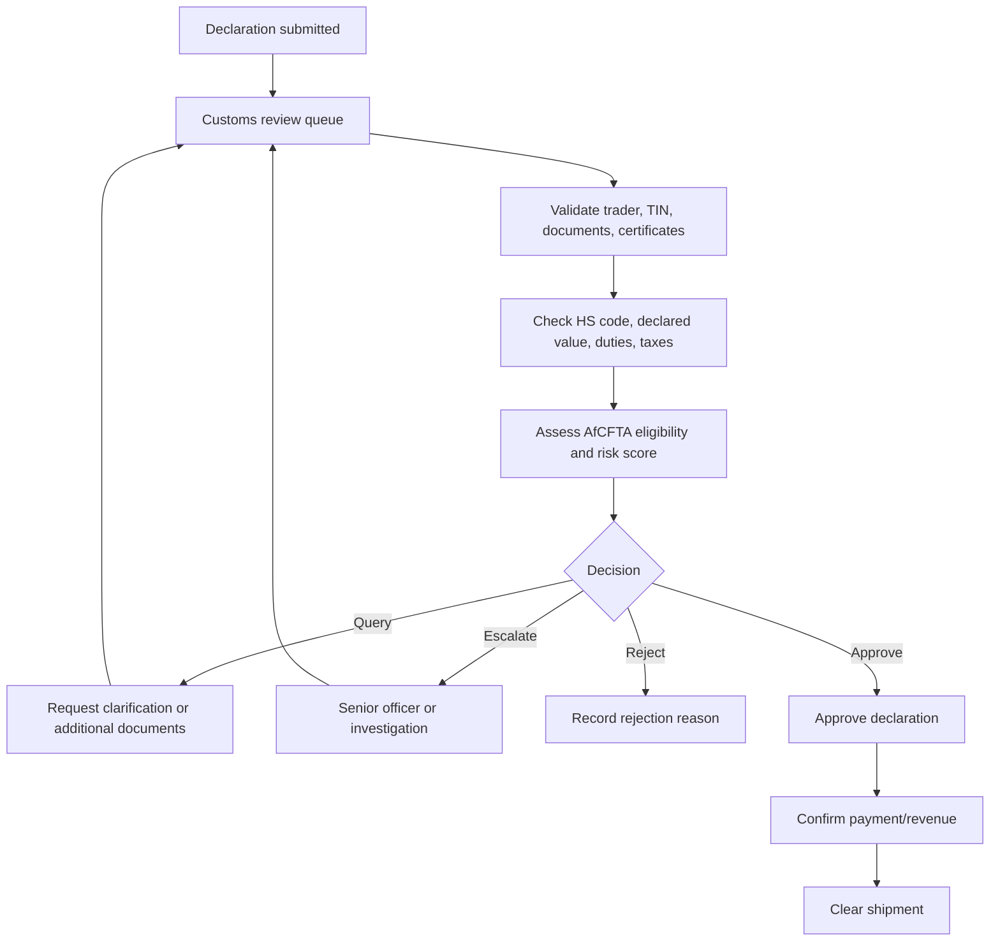
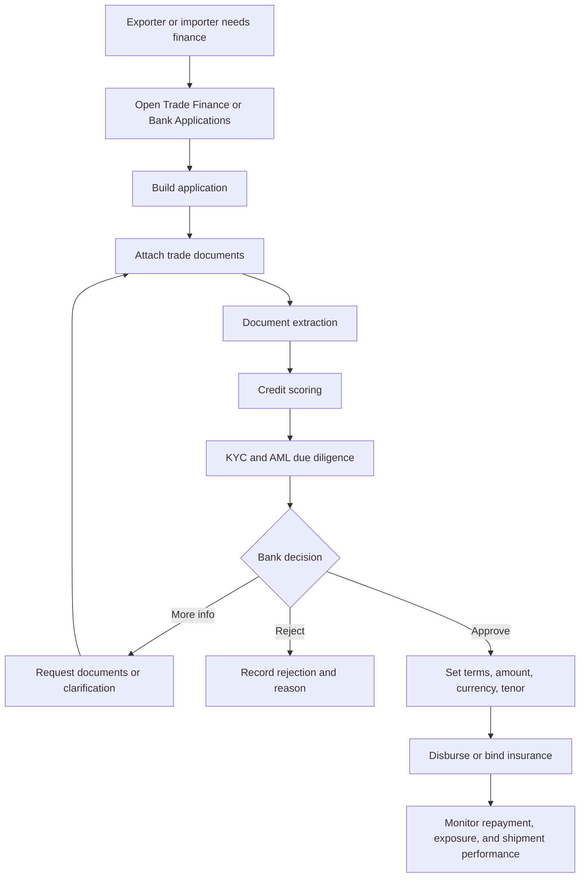
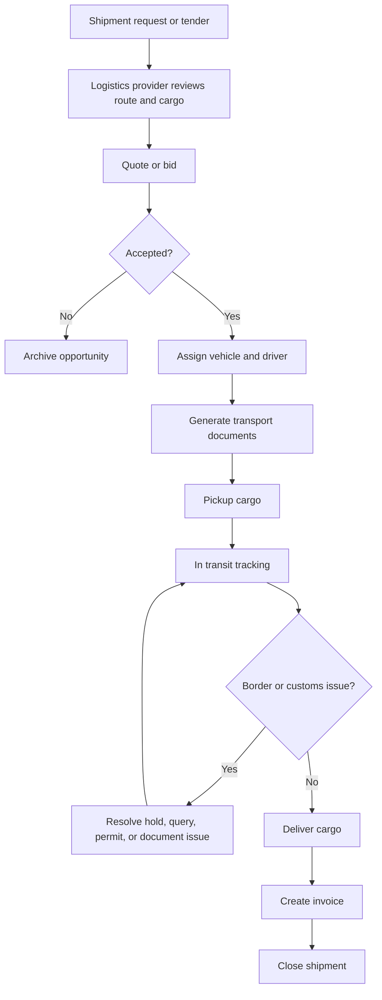
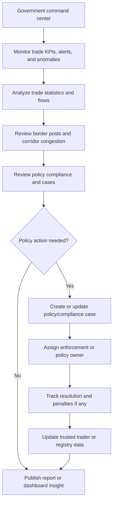
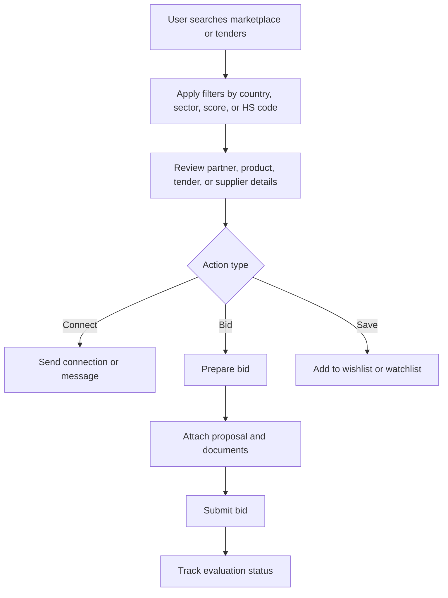
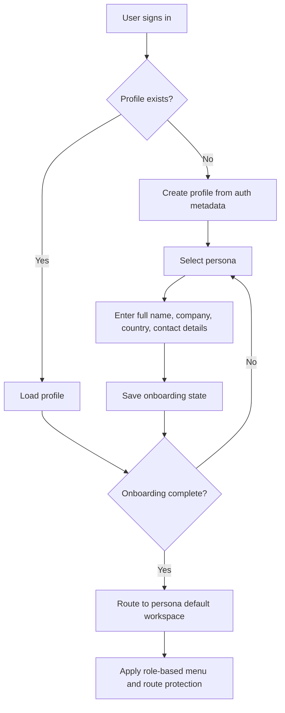

# End-to-End Workflow Diagrams

## Purpose

This document provides workflow diagrams for core AfriTrade OS operating journeys. Diagrams use Mermaid syntax so they can be rendered in GitHub, documentation portals, or compatible Markdown viewers.

## 1. Export trade lifecycle

## 2. Customs declaration review

## 3. Trade finance application

## 4. Logistics shipment execution

## 5. Government oversight and policy workflow

## 6. Marketplace and tender opportunity workflow

## 7. User onboarding and role routing

